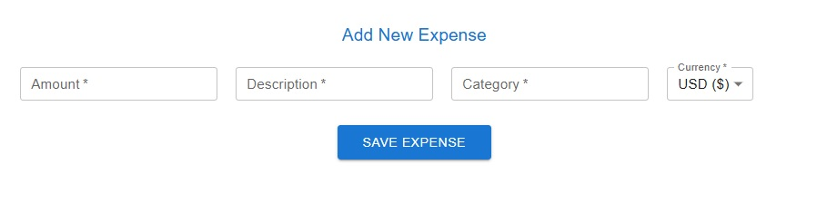
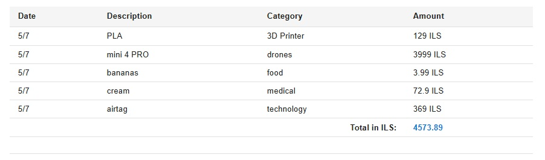
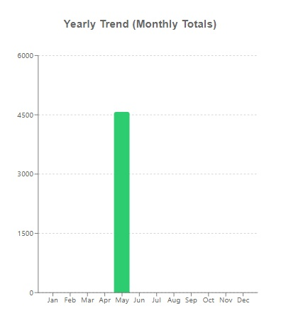
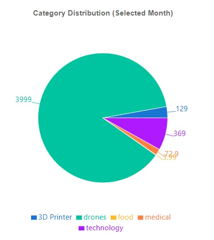

# Cost Management Application - Frontend Project

**Course:** Client-Side Development

## Project Overview

This repository contains the frontend implementation of a comprehensive cost management application. It was developed as a final project for the Client-Side Development course to demonstrate proficiency in modern web development practices. The application provides a robust user interface for individuals to actively track their personal expenses, categorize their spending, and generate detailed monthly reports.

The project emphasizes state management, component-based architecture, and integration with a backend REST API to simulate a real-world application environment.

## Application UI

### Add New Expense
UI for adding a new expense.

### Generate Report
UI form to select the parameters (month and year) for generating reports and diagrams.

### Monthly Expense Report Table
UI of a table that represents the detailed expenses of the chosen month from the generate report form.

### Yearly Expense Bar Chart
UI visualization for the yearly expenses in a bar chart diagram.

### Monthly Expense Pie Chart
UI of a pie chart that shows monthly expenses.

## Technologies Used

* **React:** Core library for building the user interface using a component-driven approach.
* **Vite:** Next-generation frontend tooling utilized for rapid development and optimized builds.
* **Material-UI (MUI):** Comprehensive suite of UI tools and React components for implementing a responsive and accessible design system.
* **Recharts:** Composable charting library built on React components, used for rendering data visualizations.

## Core Functionality and Features

* **Cost Entry System:** A dedicated interface allowing users to log new expenses. Each entry allows specifying a predefined category, a textual description, and the monetary amount.
* **Report Generation Controls:** Form interface to dynamically select the desired month and year for retrieving cost data and rendering visualizations.
* **Monthly Reporting:** Users can request and view a detailed tabular breakdown of their costs filtered by a specific month and year.
* **Data Visualizations:** To enhance data comprehension, the application translates numerical data into visual formats, providing both bar charts and pie charts to illustrate expense distributions across different categories.
* **User Profiles:** A management module for viewing and handling basic user information.

## Authors

* Abed el hafeeth Haj Yahia
* Lior Mizrachi
* Amit Hazan
